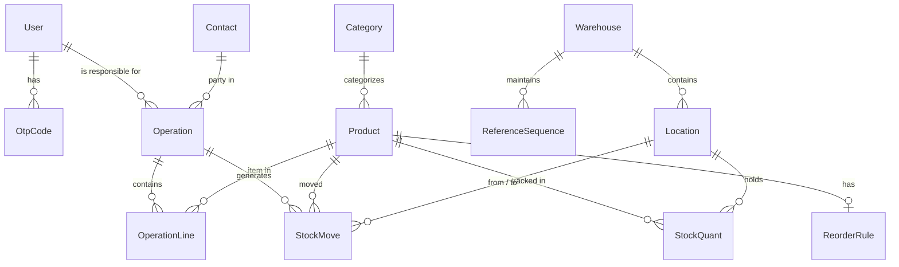

# StockSense - Database Architecture & Schema Documentation

## 1. Overview
The StockSense database is designed for a high-integrity, multi-location Inventory and Warehouse Management System (WMS). It uses MySQL 8 via Prisma ORM, utilizing strictly typed enumerations, autoincrement integer primary keys, transactional integrity (`onDelete: Restrict` by default), high-precision decimals (`Decimal(12, 3)` for stock quantities and `Decimal(12, 2)` for unit costs), and automatic timestamps on all entities.

---

## 2. Entity-Relationship Diagram

---

## 3. Tables & Field Definitions

### 3.1 Authentication & User Management
* **`users`**: System users (Managers and Warehouse Staff).
  * `id` (Int, PK, autoincrement)
  * `loginId` (VarChar 12, Unique) — 6 to 12 characters: letters, numbers or underscore.
  * `email` (VarChar, Unique) — User email for login and OTP dispatch.
  * `passwordHash` (String) — Secure bcrypt password hash.
  * `fullName` (String) — Display name.
  * `role` (Enum: `MANAGER`, `STAFF`) — Role-based access control.
  * `isActive` (Boolean, default: true) — Soft activation status.
  * `createdAt`, `updatedAt` (DateTime)

* **`otp_codes`**: 6-digit one-time passwords for authentication and password resets.
  * `id` (Int, PK, autoincrement)
  * `userId` (Int, FK $\to$ `users.id`)
  * `codeHash` (String) — Hashed OTP to prevent plaintext exposure.
  * `expiresAt` (DateTime) — 10-minute expiry window.
  * `attempts` (Int, default: 0) — Brute-force protection counter.
  * `usedAt` (DateTime, nullable) — Mark when redeemed.
  * `createdAt`, `updatedAt` (DateTime)

### 3.2 Master Catalog & Locations
* **`warehouses`**: Physical facilities.
  * `id` (Int, PK, autoincrement)
  * `name` (String) — e.g., "Main Warehouse".
  * `shortCode` (String, Unique) — e.g., "WH", prefix for operation reference codes.
  * `address` (Text, nullable) — Street address.
  * `createdAt`, `updatedAt` (DateTime)

* **`locations`**: Storage bins, shelves, and virtual transit endpoints.
  * `id` (Int, PK, autoincrement)
  * `warehouseId` (Int, nullable, FK $\to$ `warehouses.id`) — Null for global virtual locations.
  * `name` (String) — e.g., "Main Store", "Rack B", "Vendors".
  * `shortCode` (String) — e.g., "Stock1", "Prod".
  * `fullPath` (String, Unique) — e.g., "WH/Stock1", "Vendors".
  * `type` (Enum: `INTERNAL`, `VENDOR`, `CUSTOMER`, `ADJUSTMENT`)
  * `createdAt`, `updatedAt` (DateTime)

* **`categories`**: Product taxonomy.
  * `id` (Int, PK, autoincrement)
  * `name` (String, Unique) — Raw Material, Furniture, Electronics, Packaging.
  * `createdAt`, `updatedAt` (DateTime)

* **`products`**: Stockable items.
  * `id` (Int, PK, autoincrement)
  * `name` (String) — Product name.
  * `sku` (String, Unique) — Alphanumeric SKU code.
  * `categoryId` (Int, FK $\to$ `categories.id`)
  * `uom` (String) — Unit of measure (pcs, kg, roll).
  * `unitCost` (Decimal 12,2) — Cost price per unit.
  * `isActive` (Boolean, default: true)
  * `createdAt`, `updatedAt` (DateTime)

* **`reorder_rules`**: Automated inventory threshold parameters.
  * `id` (Int, PK, autoincrement)
  * `productId` (Int, Unique, FK $\to$ `products.id`)
  * `minQty` (Decimal 12,3) — Threshold triggering low stock alert.
  * `maxQty` (Decimal 12,3) — Target restock level.
  * `createdAt`, `updatedAt` (DateTime)

* **`contacts`**: External business partners.
  * `id` (Int, PK, autoincrement)
  * `name` (String) — Company or person name.
  * `type` (Enum: `SUPPLIER`, `CUSTOMER`)
  * `email`, `phone`, `address` (Nullable)
  * `createdAt`, `updatedAt` (DateTime)

### 3.3 Operations & Inventory Ledger
* **`operations`**: High-level warehouse business transactions.
  * `id` (Int, PK, autoincrement)
  * `reference` (String, Unique) — Formatted identifier: `<WarehouseShortCode>/<Type>/<Number>` (e.g., `WH/IN/0005`).
  * `type` (Enum: `RECEIPT`, `DELIVERY`, `TRANSFER`, `ADJUSTMENT`)
  * `status` (Enum: `DRAFT`, `WAITING`, `READY`, `DONE`, `CANCELLED`)
  * `contactId` (Int, nullable, FK $\to$ `contacts.id`)
  * `sourceLocationId` (Int, FK $\to$ `locations.id`)
  * `destLocationId` (Int, FK $\to$ `locations.id`)
  * `scheduleDate` (DateTime) — Planned execution date.
  * `responsibleId` (Int, FK $\to$ `users.id`)
  * `doneAt` (DateTime, nullable) — Timestamp when validated to `DONE`.
  * `notes` (Text, nullable)
  * `createdAt`, `updatedAt` (DateTime)

* **`operation_lines`**: Itemized lines for each operation.
  * `id` (Int, PK, autoincrement)
  * `operationId` (Int, FK $\to$ `operations.id`, Cascade on delete)
  * `productId` (Int, FK $\to$ `products.id`)
  * `quantity` (Decimal 12,3) — Intended transaction quantity.
  * `createdAt`, `updatedAt` (DateTime)

* **`stock_moves`**: The append-only, immutable inventory movement ledger.
  * `id` (Int, PK, autoincrement)
  * `operationId` (Int, FK $\to$ `operations.id`)
  * `productId` (Int, FK $\to$ `products.id`)
  * `fromLocationId` (Int, FK $\to$ `locations.id`)
  * `toLocationId` (Int, FK $\to$ `locations.id`)
  * `quantity` (Decimal 12,3) — Positive quantity moved.
  * `createdAt`, `updatedAt` (DateTime)

* **`stock_quants`**: Cached real-time inventory balances per location.
  * `id` (Int, PK, autoincrement)
  * `productId` (Int, FK $\to$ `products.id`)
  * `locationId` (Int, FK $\to$ `locations.id`)
  * `quantity` (Decimal 12,3, default: 0) — Current net balance.
  * `createdAt`, `updatedAt` (DateTime)
  * `@@unique([productId, locationId])`

* **`reference_sequences`**: Sequence generator for unique document codes.
  * `id` (Int, PK, autoincrement)
  * `warehouseId` (Int, FK $\to$ `warehouses.id`)
  * `type` (Enum: `RECEIPT`, `DELIVERY`, `TRANSFER`, `ADJUSTMENT`)
  * `nextNumber` (Int, default: 1)
  * `createdAt`, `updatedAt` (DateTime)
  * `@@unique([warehouseId, type])`

---

## 4. Key Architectural Design Decisions

### 4.1 Double-Entry Inventory Principle (Virtual Locations)
In traditional accounting, every credit requires an equal debit. StockSense adopts the same **double-entry principle**:
* Goods are never created or destroyed out of nowhere.
* Every movement has both a **Source Location** and a **Destination Location**:
  * **Receipts (`RECEIPT`)**: `Vendors` (Virtual) $\to$ `Internal Location` (Physical).
  * **Deliveries (`DELIVERY`)**: `Internal Location` (Physical) $\to$ `Customers` (Virtual).
  * **Internal Transfers (`TRANSFER`)**: `Internal Location A` $\to$ `Internal Location B`.
  * **Inventory Adjustments (`ADJUSTMENT`)**: `Internal Location` $\rightleftharpoons$ `Inventory Adjustment` (Virtual).
* Because of this, the total system balance is always mathematically conserved, providing complete auditability.

### 4.2 Why Both `StockMove` (Ledger) and `StockQuant` (Balance)?
A common design question is: *"Why have both a ledger table and a balance table?"*

1. **`StockMove` is the Single Source of Truth (The Ledger):**
   * Rows are **append-only**: they are never updated or deleted.
   * Tells the complete historical story: *Who moved what, when, where from, and why.*
   * Essential for traceability, dispute resolution, and regulatory audits.

2. **`StockQuant` is the Performance Index (The Balance):**
   * If we only had `StockMove`, computing how many units of `DESK001` are currently on shelf `WH/Stock1` would require executing `SUM(quantity)` across thousands or millions of ledger records on every page load.
   * `StockQuant` maintains the current net snapshot in $O(1)$ time.
   * Every validation transaction atomically writes the `StockMove` row AND updates the corresponding `StockQuant` row inside the **same database transaction**, ensuring they never diverge.
